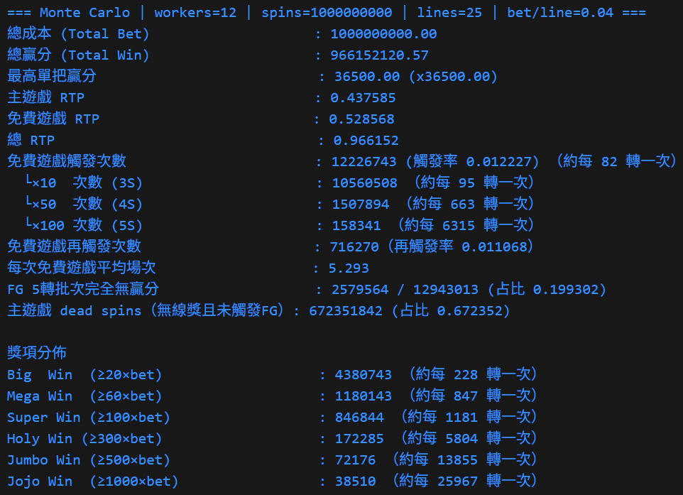
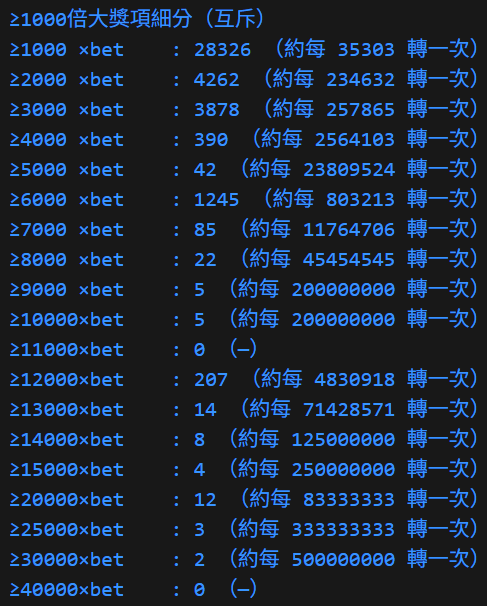
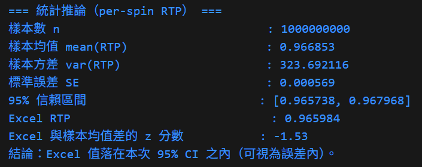

# slot10_50_100_GO

- Slot simulator demo

- 模擬遊戲數據，輸出各項統計資料

- 遊戲規則與程式流程請見程式檔頭註解

## 環境需求
- Windows 10/11
- Go 1.24

## 開發工具(建議)
- Visual Studio Code
  - 擴充：Go (golang.go)

## Build
- go build -o slot10_50_100.exe .

## Run (example)
- .\slot10_50_100.exe 或 go run .\slot10_50_100.go

## 附註
- 本專案中之.go檔無外部依賴，迅速試跑可直接貼進VScode/VS或其他編譯軟體測試

## 模擬器輸出示意圖

  
   RTP、獎項分佈、峰值摘要等

  
   大獎詳細分層

  
   與Excel試算之結果驗證

